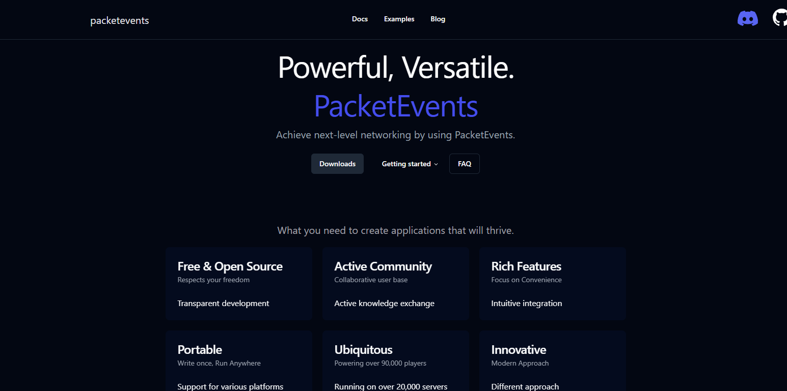

# PacketEvents Website (Work in Progress)
Welcome to the source code for the PacketEvents Website! This was engineered using React, Typescript, tailwind & shadcn components.

# How to Build
1. Clone the GitHub project
2. Run `npm build`
3. Host locally using `npm run dev`

# Alternative Way to Host
### 1. Compile the project and utilize GitHub pages
### 2. Import project in Vercel & host
